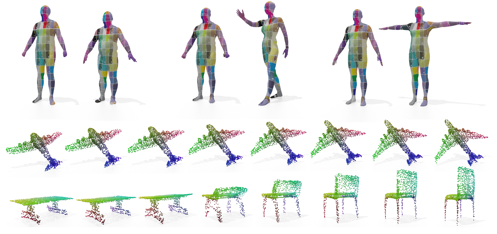

# **Shape Registration in the Time of Transformers** [[Paper]](https://arxiv.org/abs/2106.13679)

**Shape Registration in the Time of Transformers** <br>Giovanni Trappolini, Luca Cosmo, Luca Moschella, Riccardo Marin, Simone Melzi, Emanuele Rodolà  <br>
In [Neurips, 2021](https://proceedings.neurips.cc/paper/2021/hash/2d3d9d5373f378108cdbd30a3c52bd3e-Abstract.html)




### Code Usage & Reproducible Results

Download the dataset folder [here](https://www.dropbox.com/sh/wpm783ncirfurzp/AAACQTUWgy7tO7gpAlJM6CD_a?dl=0) and put it under
transmatching/test/ .

Install environment and dependencies:

```bash

conda create -n transformer_matching
conda activate transformer_matching

conda install pytorch torchvision torchaudio cudatoolkit=10.2 -c pytorch
conda install -c conda-forge igl
pip install ./transmatching


cd transmatching/test
```

To train the model just run

```bash
python train.py
```

To test the model please look into `evaluation`
